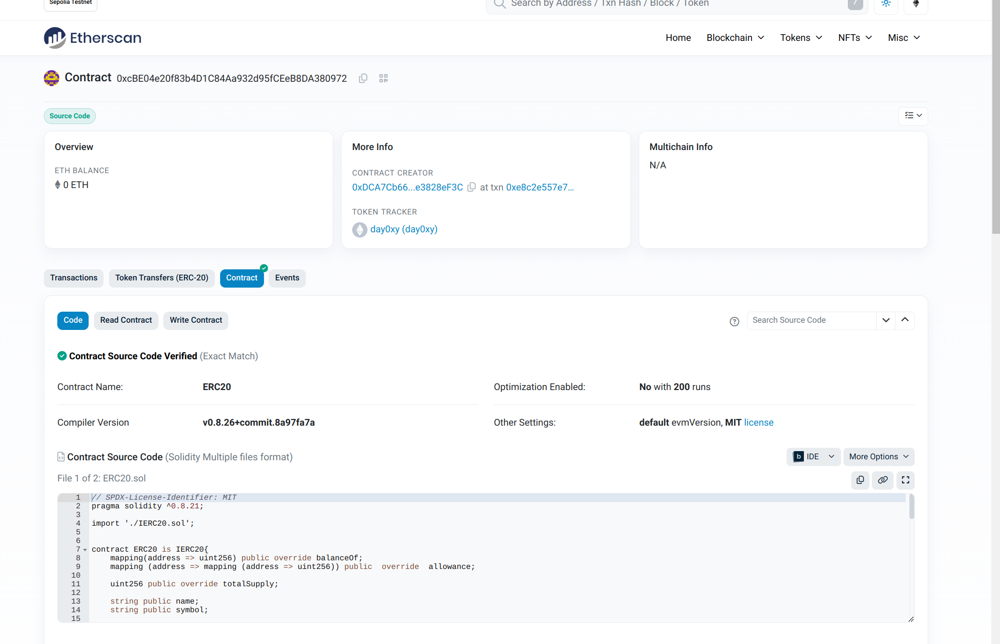
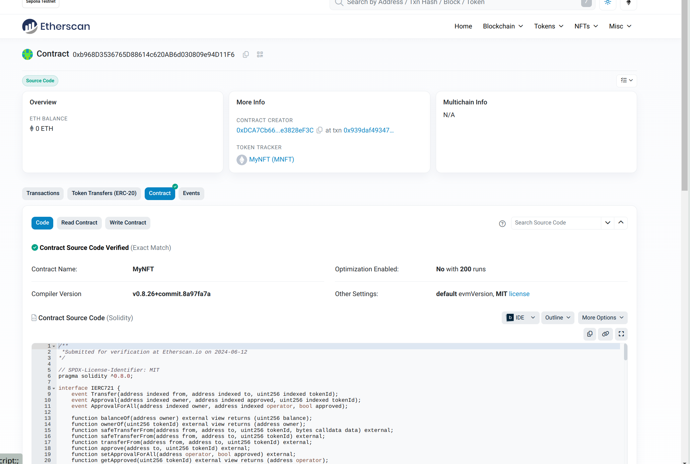
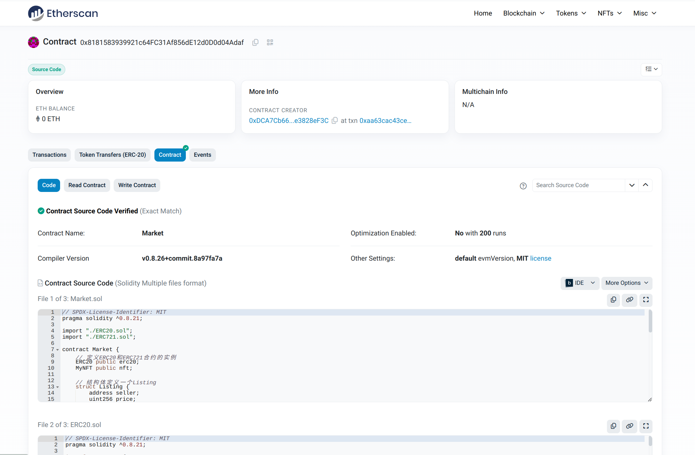
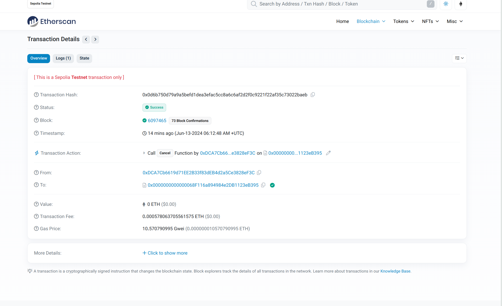
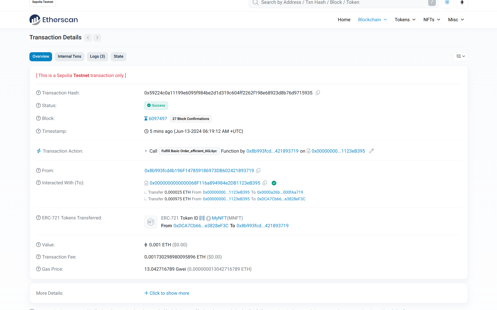
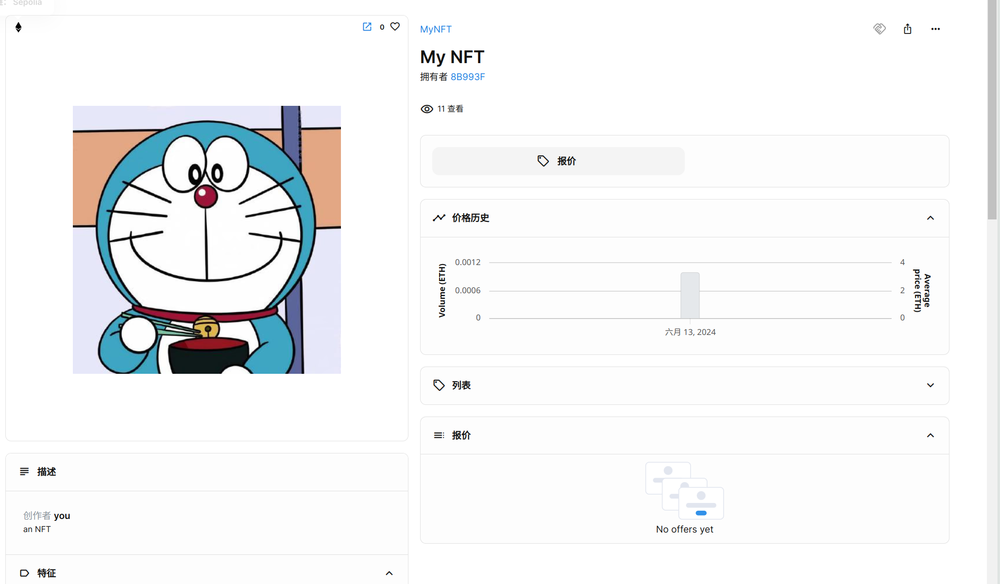

# ERC20

## 合约地址

0xcBE04e20f83b4D1C84Aa932d95fCEeB8DA380972

## 开源截图

# ERC721

## 合约地址

0xb968D3536765D88614c620AB6d030809e94D11F6

## 开源截图

# Market

## 合约地址

0x8181583939921c64fc31af856de12d0d0d04adaf

## 开源截图

# 交易购买nft

## 上架hash

0x0d6b750d79a9a5befd1dea3efac5cc8a6c6af2d2f0c9221f22af35c73022baeb

## 交易hash

0x59224c0a11199e6095f984be2d1d319c604ff2262f198e68923d8b76d9715935

## 交易截图

# nft可见的图片

https://testnets.opensea.io/zh-CN/assets/sepolia/0xb968d3536765d88614c620ab6d030809e94d11f6/0

